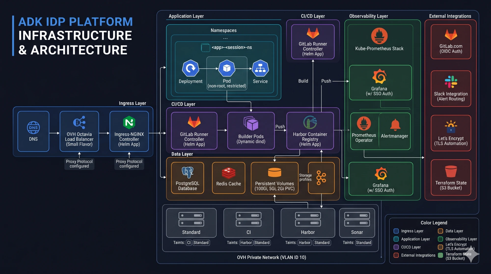

# Platform services: registry, quality gates, observability, SSO and TLS

By now the cluster exists and ArgoCD is reconciling whatever lives under `manifests/`. This post is the tour of what actually lives there: the services that turn a bare Kubernetes cluster into a platform. None of these are exotic on their own. What matters is how they are configured and wired together, because this is the plumbing that every deployed application quietly depends on. It is also the part that developers most underestimate and most appreciate once it exists.

Everything below is a child application under the ArgoCD root from the previous post, each pinned to a specific Helm chart version and, where it matters, pinned to a specific node pool. This is the whole platform plane in one picture: the ingress, application, CI/CD, data and observability layers, the external integrations they lean on, and the four isolated node pools from Post 2 at the base.



## Harbor: a private registry with a security opinion

Images are built and pushed to a self-hosted Harbor registry rather than a public one. Harbor runs on its own tainted node pool so registry throughput and storage are never starved by a noisy build, and it is backed by OVH block storage (around 100Gi for the registry, plus smaller volumes for its database and Redis cache).

The reason to self-host rather than lean on a public registry is control: images stay private by default, and Harbor runs Trivy vulnerability scanning over what gets pushed. Combined with the build approach from the golden path (Kaniko, which builds images without a privileged Docker socket), the registry story avoids the classic host-escape vector where a build container is handed `/var/run/docker.sock`.

## SonarQube: a quality gate, not a dashboard

SonarQube runs with its own PostgreSQL database on its own tainted node pool, because static analysis is memory-hungry and should not compete with running apps. But the important design choice is where it sits in the flow: it is the first stage of every generated pipeline, before the image is built.

That placement makes it a gate rather than a report nobody reads. If the analysis fails the configured quality threshold, the pipeline can stop before an image is ever produced. Quality feedback that arrives before the build is feedback developers act on.

## Prometheus, Grafana and alerts that reach a human

Observability comes from the `kube-prometheus-stack` Helm chart, which bundles the Prometheus operator, Grafana, and Alertmanager. Grafana is exposed over TLS and authenticates against injected credentials rather than a default password.

Two touches make the alerting usable rather than noisy. Alertmanager uses inhibition rules so that a severe alert suppresses the minor warnings it would inevitably trigger at the same time, which keeps a single incident from becoming a wall of notifications. And alerts are routed to Slack through a custom message template that includes severity, direct links, and runbook pointers, so the message that lands in the channel is actually actionable.

## cert-manager: TLS nobody has to think about

TLS is fully automated through cert-manager and a single cluster-wide issuer.

```yaml
apiVersion: cert-manager.io/v1
kind: ClusterIssuer
metadata:
  name: letsencrypt-prod
spec:
  acme:
    server: https://acme-v02.api.letsencrypt.org/directory
    email: platform@example.com
```

With the `letsencrypt-prod` issuer in place, any ingress on the platform gets a valid Let's Encrypt certificate just by carrying one annotation:

```yaml
cert-manager.io/cluster-issuer: "letsencrypt-prod"
```

cert-manager handles the HTTP-01 challenge and provisions and renews the certificate. No developer, and no AI agent, ever handles a private key.

## oauth2-proxy: SSO scoped to a group

Platform UIs (ArgoCD, Grafana, the agent interface) sit behind oauth2-proxy, configured as a GitLab OIDC client. The crucial constraint is a single line of configuration:

```yaml
extraArgs:
  gitlab-group: "your-org/idp-platform"
```

That scopes access to members of one authorised GitLab group. Any ingress can opt into this protection by adding a pair of annotations that route unauthenticated traffic through the proxy's auth endpoint first. SSO becomes something you turn on per service with two lines, not a bespoke integration each time.

## Least-privilege backends for the AI agents

The last residents of this layer are the two MCP servers the AI control plane calls: one for GitLab, one for Kubernetes. They run on-cluster precisely so the agents can reach them over Server-Sent Events, which is the transport the agents use (more on that in Post 6).

Because the Kubernetes MCP server is what the AI effectively acts through, its permissions are deliberately narrow. The service account it runs under can manage Namespaces, Services, ResourceQuotas, Deployments, Ingresses, NetworkPolicies, and ArgoCD Applications, but on raw Pods it is limited to read and delete. It cannot create pods directly; workloads come into existence through Deployments. The guardrail is not only in the agent's prompt, it is in the RBAC the agent's tools run under. That layering, prompt plus RBAC plus templates, is a theme we will return to.

## The point of all this plumbing

A developer onboarding an app to this platform never installs a registry, configures SSO, provisions a certificate, or wires up a dashboard. They get all of it because it already exists, correctly configured, reconciled by GitOps. That is the quiet half of an IDP: not the clever automation on top, but the solid, opinionated services underneath that make the automation safe.

## What's next

1. Why an IDP, and the architecture map.
2. From zero to a cluster - OVH Managed Kubernetes with Terraform.
3. GitOps bootstrap - ArgoCD app-of-apps, and keeping secrets out of Git.
4. **This post** - Harbor, SonarQube, Prometheus/Grafana, SSO and automatic TLS.
5. **The golden path** - templating Dockerfiles, pipelines and manifests, and the annotation system that lets an AI edit them safely.
6. The AI control plane - Google ADK, multi-agent delegation, and guardrails written in English.

With the services in place, the next post covers the contract that ties them to the deployments: the golden-path templates, and the annotation trick that lets an AI fill them in without ever touching a security-critical line.
