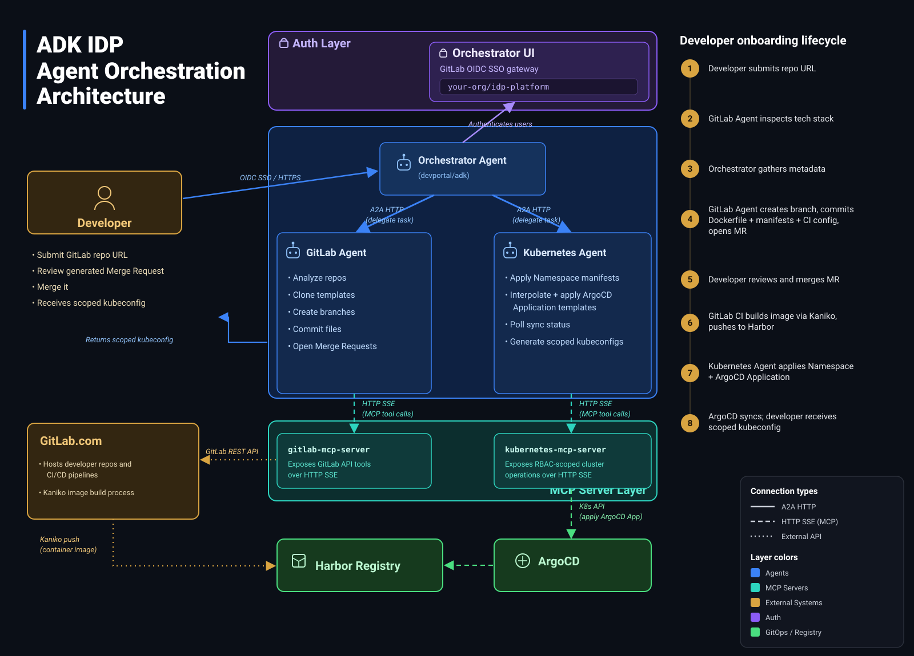

# The AI control plane: multi-agent orchestration, and guardrails written in English

Five posts in, the platform is complete except for the part that makes it unusual. We have a cluster, GitOps, a set of services, and a golden path of templates. What we have not yet described is the thing a developer actually talks to. This final post is about the `orchestrator/` layer (originally the `adk` repository): the multi-agent AI system that reads a repository, fills the templates, and drives a deployment to live. It is both the most distinctive part of the project and the most honest about its limits.




## Three agents, one that talks

The control plane is built on the Google Agent Development Kit (ADK) and is made of three agents.

The **orchestrator agent** (running on Gemini Flash) is the only one a developer ever talks to. It owns the conversation and the workflow. Behind it sit two silent specialists: a **GitLab agent** that handles repositories, branches, and merge requests, and a **Kubernetes agent** that generates manifests and talks to the cluster. The sub-agents never address the user directly; they receive structured tasks from the orchestrator and report back, and the orchestrator synthesises everything into the single voice the developer hears.

The agents find and talk to each other over Agent-to-Agent (A2A) HTTP, discovering one another through Kubernetes DNS. Each specialist in turn reaches its tools through a Model Context Protocol (MCP) server over Server-Sent Events:

```python
from google.adk.tools.mcp_tool.mcp_toolset import McpToolset, SseConnectionParams

kubernetes_mcp_toolset = McpToolset(
    connection_params=SseConnectionParams(
        url=os.environ["KUBERNETES_MCP_SERVER_URL"],  # on-cluster, over SSE
        timeout=1000,
    )
)
```

This is why, back in Post 4, the MCP servers were deployed on the cluster rather than spawned as local processes: SSE is the transport the agents rely on, and running the servers in-cluster lets the agents reach them over internal DNS.

## A workflow, not a free-for-all

An LLM that can create branches and apply Kubernetes manifests is not something you want improvising. So the orchestrator does not "figure it out." It follows a strict, eight-step sequence with explicit success conditions and failure paths, and it does not skip ahead:

1. Greet the developer and take the repository URL, validating it belongs to the authorised group.
2. Have the GitLab agent analyse the repo: tech stack, ports, existing Dockerfiles.
3. Gather requirements: namespace, resource tier, ingress and TLS preferences.
4. Fill the templates and commit them to a branch (`deploy/<app>-<session_id>`) on the developer's own repo, then open a merge request.
5. Wait for the pipeline to pass after the developer merges.
6. Generate and push the manifests, and create the namespace on the cluster.
7. Create the ArgoCD Application and poll until it is Synced and Healthy.
8. Present a summary: branch, namespace, tier, ingress, status.

Step 4 is worth pausing on. The agent never pushes to `main`, never modifies the developer's existing files, and never creates a new repository. It adds new files on a branch and opens a merge request, which means a human reviews and approves every change the AI proposes before anything builds. The human-in-the-loop is not a nicety; it is the primary safety control.

## The product logic is a prompt

Here is the part that is genuinely novel and genuinely uncomfortable. The platform's rules are not, for the most part, code. They are written in natural language, in the agents' instructions. The GitLab agent's prompt, for example, contains hard constraints like these:

```text
- STRICT RULE: You must NEVER create new repositories. All deployment files
  are pushed to a NEW BRANCH on the user's EXISTING repository.
- STRICT RULE: You must NEVER push files directly to the main/default branch.
- STRICT RULE: You must NEVER modify, delete, or overwrite existing files.
```

Writing policy in English is what makes the system flexible and fast to build. It is also fragile: a language model does not execute its instructions the way a program executes a branch. It is more accurate to say it is strongly inclined to follow them.

The project's answer to that fragility is not to trust the prompt. It is defense in depth. The prompt is only the first layer. Beneath it, the golden-path templates make the dangerous lines literally unavailable to edit (Post 5). Beneath that, the Kubernetes MCP server's RBAC cannot create pods or grant cluster-admin no matter what the agent is convinced to attempt (Post 4). And wrapping all of it, the merge-request gate puts a human between the AI's proposal and reality. Any single layer can fail; they are not meant to be relied on alone. That is the honest way to put an LLM in a position of real power: assume it will sometimes be wrong, and make sure that being wrong is contained.

## Looking back at the whole thing

Step back and the series traces one idea down through four layers. Terraform builds a cluster that isolates and protects itself. ArgoCD makes Git the single source of truth. The platform services provide the registry, quality gate, observability, SSO, and TLS that every app needs. The templates encode the one safe shape an app may take. And the AI control plane lets a developer reach all of it through a conversation, while the layers beneath keep that conversation from doing harm.

The thesis underneath is simple: the safe way and the easy way should be the same way. A developer who just wants their app running gets non-root containers, default-deny networking, automatic TLS, continuous reconciliation, and vulnerability scanning, not because they asked, but because the platform offers no less-safe path. That is what an Internal Developer Platform is for, and the AI on top is what makes the easy way feel effortless.

It is not finished, and it is worth saying so plainly. It is a proof of concept: there are no automated tests, the AI layer is non-deterministic by nature, and it is wired to one specific OVH, GitLab, and Gemini setup. What it demonstrates is that the pieces fit, and that an AI control plane over a properly guardrailed platform is a real and interesting way to build a golden path.

## Thanks

This entire platform was designed and built by **Nand Beeckx** during his internship at FlowFactor, from the Terraform foundations all the way up to the multi-agent AI control plane. The `[AGENT-LOCK]` / `[AGENT-EDIT]` idea at the heart of the golden path, the two-plane architecture, and the eight-step guardrailed workflow are all his. Thanks, Nand, for the work and for documenting it well enough that we could turn it into this series, and thanks to the FlowFactor team who coached him along the way.

The full source, cleaned up for public reading, is on GitHub, one directory per layer described in these posts.

## The series

1. Why an IDP, and the architecture map.
2. From zero to a cluster - OVH Managed Kubernetes with Terraform.
3. GitOps bootstrap - ArgoCD app-of-apps, and keeping secrets out of Git.
4. Platform services - Harbor, SonarQube, Prometheus/Grafana, SSO and automatic TLS.
5. The golden path - templating Dockerfiles, pipelines and manifests, and the annotation system that lets an AI edit them safely.
6. **This post** - Google ADK, multi-agent delegation, and guardrails written in English.
